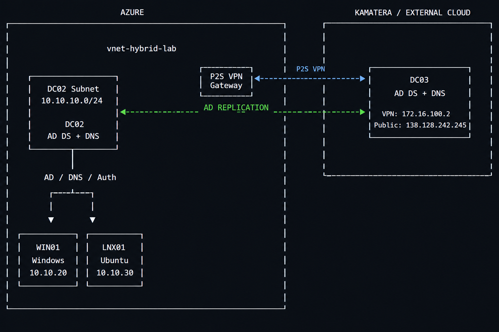
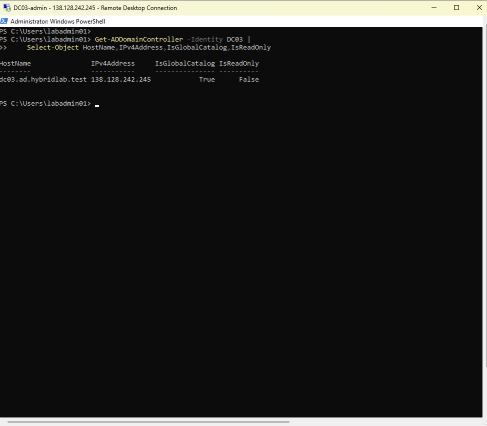
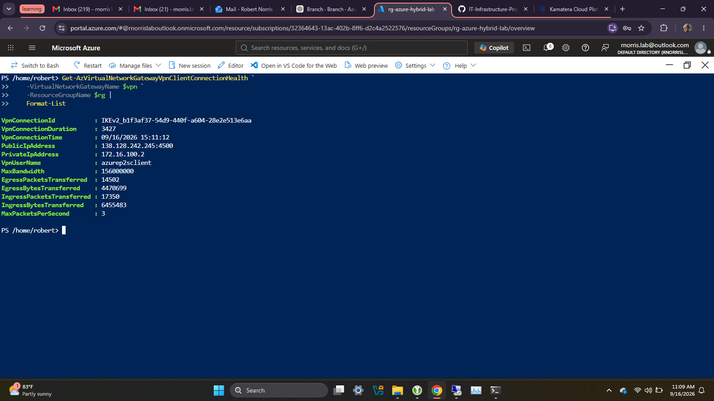
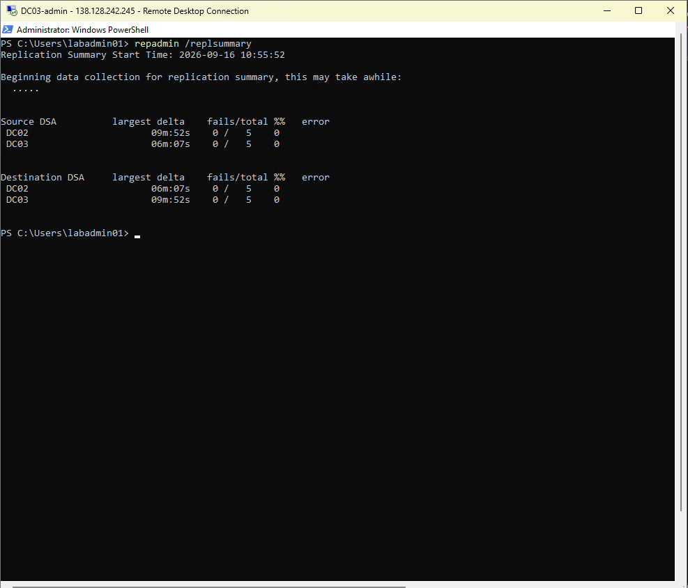
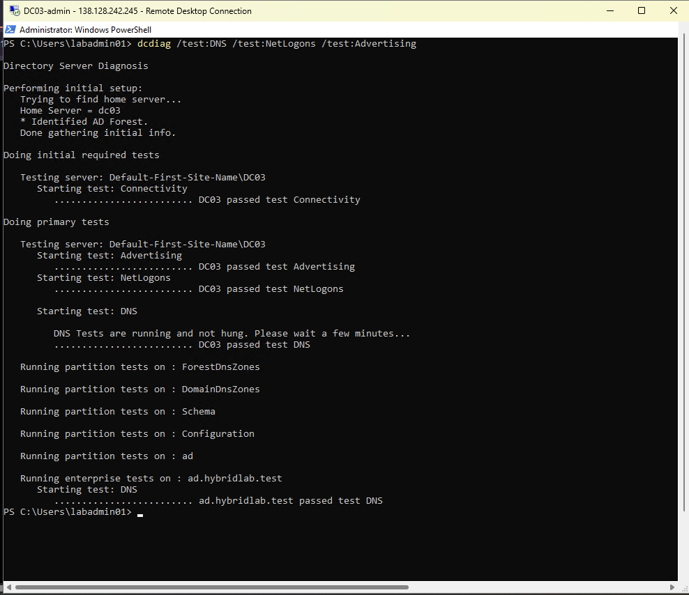
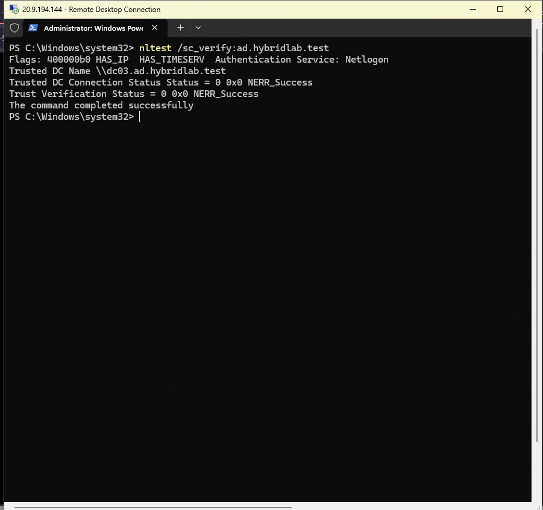
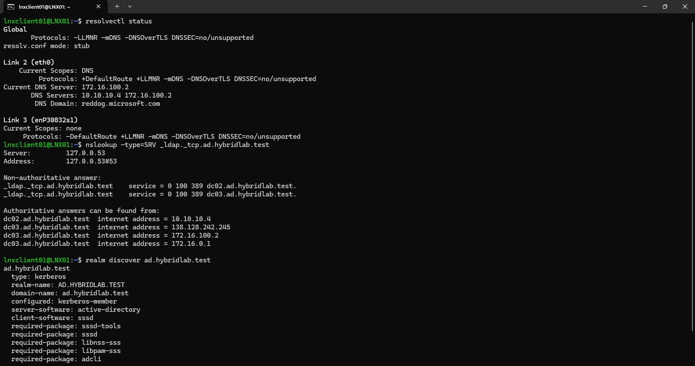

# Azure Hybrid Active Directory & Domain Controller Redundancy Lab

### Overview

This project is a hybrid Active Directory lab designed to practice Windows Server administration, Active Directory, DNS, Azure networking, VPN connectivity, and domain-controller redundancy.

The environment consists of a primary domain controller hosted in Microsoft Azure and a secondary domain controller hosted externally through Kamatera. Azure-based Windows and Linux clients are joined to the same Active Directory domain and can discover either domain controller.

---

### Objectives

* Deploy and administer Active Directory Domain Services in Microsoft Azure.
* Configure DNS and Azure networking for an Active Directory environment.
* Establish secure connectivity between Azure and an external network using an IKEv2 Point-to-Site VPN.
* Deploy a secondary domain controller outside Azure.
* Configure and verify Active Directory replication between domain controllers.
* Validate domain-controller discovery and redundancy from Windows and Linux clients.

---

### Environment

| Component      | Platform                         | Role                                             |
| -------------- | -------------------------------- | ------------------------------------------------ |
| DC02           | Microsoft Azure / Windows Server | Primary Domain Controller, DNS, Global Catalog   |
| DC03           | Kamatera / Windows Server 2022   | Secondary Domain Controller, DNS, Global Catalog |
| Windows Client | Microsoft Azure                  | Domain-joined client                             |
| Linux Client   | Microsoft Azure / Ubuntu         | Domain-joined client                             |

**Active Directory Domain:** `ad.hybridlab.test`

---

### Architecture



The environment uses Azure Point-to-Site VPN connectivity to connect the external DC03 server to the Azure network.

* **DC02** provides the primary Active Directory and DNS services.
* **DC03** provides a second writable domain controller and Global Catalog.
* **Azure Windows and Linux clients** can discover available domain controllers through Active Directory DNS/DC Locator.
* **DC02 and DC03** replicate Active Directory data across the VPN connection.

---

### Implementation

### Azure Domain Controller

The initial environment was deployed in Microsoft Azure with Windows Server configured as the primary domain controller.

Key services and components included:

* Active Directory Domain Services
* DNS
* Global Catalog
* Azure Virtual Network
* Azure Network Security Group
* PowerShell-based administration

### External Domain Controller

A separate Windows Server 2022 system was deployed in Kamatera and added to the existing `ad.hybridlab.test` domain.

DC03 was promoted to a writable domain controller and Global Catalog, providing a second domain controller outside the Azure environment.



### Azure Point-to-Site VPN

An IKEv2 Point-to-Site VPN was configured to provide connectivity between the Azure environment and DC03.

DC03 received the VPN address:

`172.16.100.2`

The VPN allowed DC03 to communicate with the Azure domain controller at:

`10.10.10.4`



### Active Directory Replication

Replication between DC02 and DC03 was verified using `repadmin`.

Final replication status:

```text
Source DSA          fails/total
DC02                0 / 5
DC03                0 / 5
```



### Domain Controller Health

DC03 was validated using `dcdiag` for DNS, NetLogons, and Advertising.

```text
DC03 passed test Advertising
DC03 passed test NetLogons
DC03 passed test DNS

ad.hybridlab.test passed test DNS
```



---

### Client Redundancy

The existing Azure Windows and Linux clients were configured as members of the `ad.hybridlab.test` domain.

Both clients were tested for domain-controller discovery to verify that DC02 and DC03 were available through Active Directory DNS and DC Locator.

### Windows Client

```powershell
nltest /dsgetdc:ad.hybridlab.test
```

The client was able to discover available domain controllers in the domain.



### Linux Client

The Linux client was tested using DNS-based Active Directory discovery.

```bash
nslookup -type=SRV _ldap._tcp.ad.hybridlab.test
```

The returned records included both DC02 and DC03.



---

### Troubleshooting

During implementation, several Active Directory and DNS issues were encountered.

One significant issue was Active Directory replication error `8524`, indicating a DNS lookup failure. Investigation with `dcdiag`, `repadmin`, `nslookup`, and `nltest` identified DNS registration issues affecting the new domain controller.

After correcting the DNS configuration and forcing DNS/Netlogon registration, the required Active Directory SRV and CNAME records became available and replication completed successfully.

This troubleshooting process helped validate the relationship between Active Directory replication, DNS, Netlogon, and domain-controller discovery.

---

### Verification

The final environment successfully demonstrated:

* Two writable Active Directory domain controllers.
* Both domain controllers operating as Global Catalog servers.
* Successful DNS registration for DC03.
* Successful Active Directory replication between DC02 and DC03.
* Successful DNS, NetLogon, and DC advertising health checks.
* Successful Azure-to-external connectivity through the P2S VPN.
* Windows and Linux clients able to discover available domain controllers.

---

### Technologies

* Microsoft Azure
* Windows Server 2022
* Active Directory Domain Services
* DNS
* PowerShell
* Azure Point-to-Site VPN
* IKEv2
* Active Directory Replication
* Windows
* Ubuntu Linux
* Azure Virtual Network
* Network Security Groups
* Kamatera

---

### Final Results

- Azure-hosted domain controller configured successfully
- External domain controller integrated successfully
- Windows client connected to the domain
- Ubuntu client integrated with Active Directory
- DNS resolution and authentication verified
- Hybrid connectivity between environments confirmed

---

### Return page
[Return to Repository Hub](https://github.com/RobNor12/IT-Automation-Engineering/blob/main/README.md)
